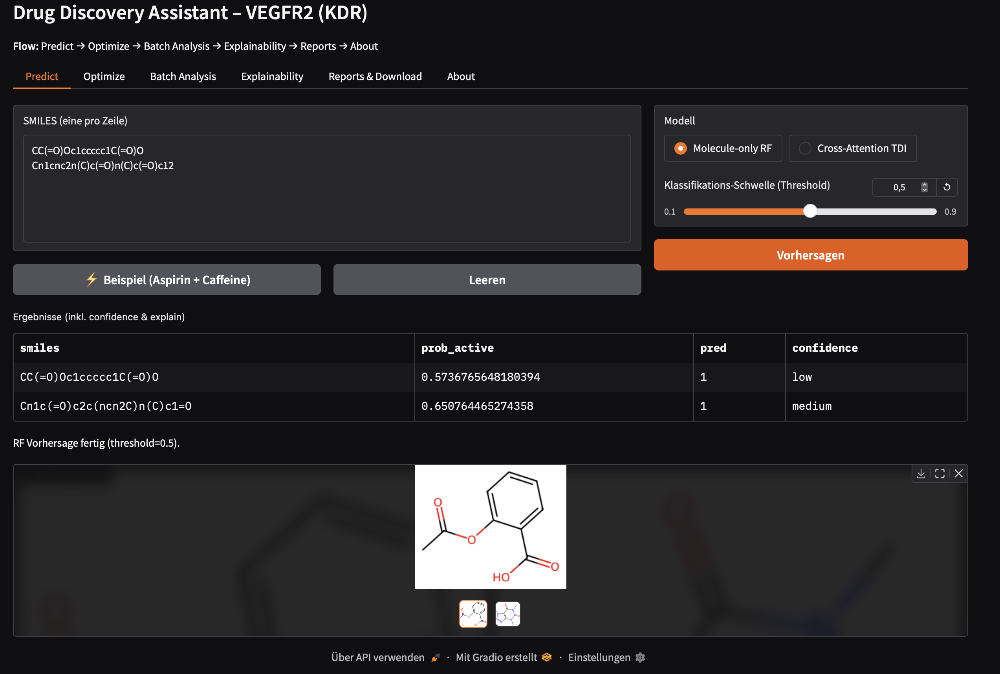
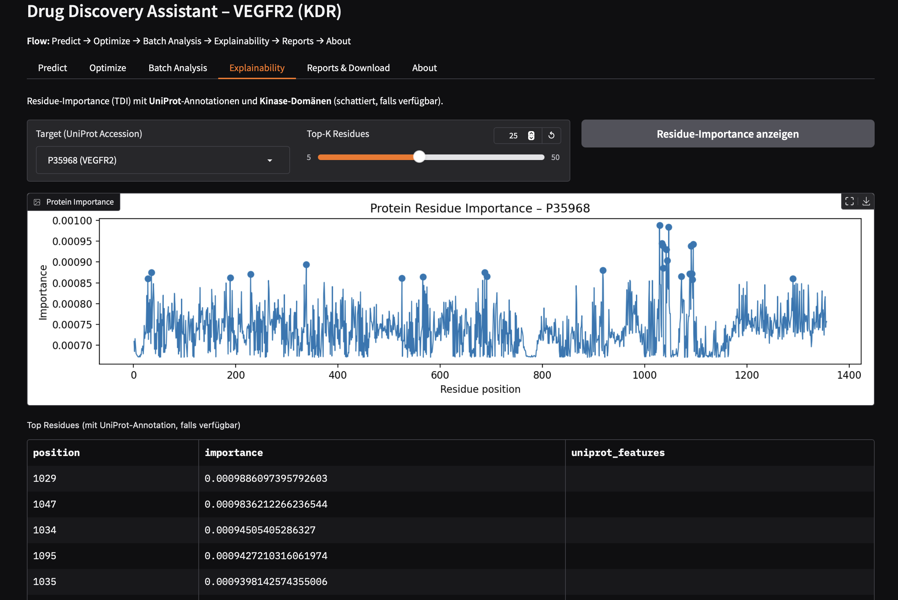

!# Drug Discovery Assistant

Ein End-to-End KI-gestütztes System für **Drug Discovery**.  
Die Applikation kombiniert moderne Methoden wie Molekül-Featurization, Protein Language Models (ESM-2), Cross-Attention** und Explainability, um:  
- Molekül-Eigenschaften vorherzusagen  
- Protein–Ligand-Interaktionen zu modellieren  
- Neue Kandidaten-Moleküle zu generieren  
- Ergebnisse verständlich zu visualisieren  

---

## 🚀 Features
- **Molecular Property Prediction**: Vorhersage von ADMET-relevanten Eigenschaften  
- **Target–Drug Interaction (TDI)**: Cross-Attention Modell für Protein-Ligand-Bindung  
- **Explainability**: Residue-Importance Reports, UniProt-Mapping  
- **Optimization**: BRICS-basierte Molekül-Generierung + Multi-Objective Scoring  
- **User Interface**: Gradio Web-App mit Prediction, Batch, Optimization und Export  
- **Deployment-ready**: Dockerfile + CI/CD Pipeline  
- **Reports**: CSV, SDF, PNG und ZIP für Dokumentation  

---

## 🧪 Eingabe & Modellverständnis

### SMILES-Eingabe
- Eine Verbindung pro Zeile (SMILES).
- Möglichst **ohne Salze/Gegenionen** (nur größte organische Komponente).
- RDKit-kompatibel; exotische Metalle/Komplexe können fehlschlagen.
- Die App kanonisiert SMILES intern.

**Beispiele**
```text
CC(=O)Oc1ccccc1C(=O)O          # Aspirin
Cn1cnc2n(C)c(=O)n(C)c(=O)c12   # Koffein
CC(=O)NC1=CC=C(C=C1)O          # Paracetamol
CC(C)CC1=CC=C(C=C1)C(C)C(=O)O  # Ibuprofen
```


## 📸 Screenshots

### Molekülvorhersage


### Explainability Report



---

## 📂 Repository Struktur
```text
├── data/                 # Rohdaten, verarbeitet & Embeddings
├── src/                  # Quellcode (Features, Modelle, Utils)
├── scripts/              # Trainings-, Optimierungs- und UI-Skripte
├── reports/              # Generierte Reports (CSV, PNG, SDF, ZIP)
├── docs/screenshots/     # Screenshots für README
├── environment.yml       # Conda Environment
├── Dockerfile            # Docker Setup
├── README.md             # Hauptdokumentation
└── PROJECT.md            # Projektbeschreibung (Paper-Style)
```


## ⚡ Quickstart

### 1) Repository klonen

## via SSH
```
git clone git@github.com:clavinci94/drug-discovery-assistant.git
```

### oder via HTTPS
```
git clone https://github.com/clavinci94/drug-discovery-assistant.git

cd drug-discovery-assistant
```


### 2) Lokal mit conda starten
conda env create -f environment.yml
conda activate drug_discovery

python test_setup.py  # kurzer Setup-Check

## Laufzeit-ENV
export PYTHONPATH="."
export GRADIO_SERVER_NAME="0.0.0.0"
export GRADIO_SERVER_PORT=7862

python scripts/app_gradio.py


👉 Öffne im Browser: [http://127.0.0.1:7860](http://127.0.0.1:7862)

### 3. Mit Docker starten
docker build -t drug-discovery:cpu .
PORT=7861 docker compose up

👉 Öffne im Browser: http://127.0.0.1:7861

### Nützliche Docker - Commandos

docker compose logs -f app   # Logs der App
docker compose ps            # Container-Status
docker compose down          # Stoppen & Aufräumen

## 📊 Ergebnisse
Random Forest: AUC ≈ 0.86
Cross-Attention TDI: AUC ≈ 0.87–0.88, PR-AUC > 0.93
Residue-Importance stimmt mit bekannten VEGFR2-Kinase-Domänen überein
Optimierte Moleküle zeigen verbesserte Aktivität + Drug-Likeness Scores

## ⚠️ Limitierungen
Demo basiert auf VEGFR2 (CHEMBL279), Single-Target
Datensatzgröße begrenzt (≤ 1000 Moleküle)
Keine experimentelle Validierung (nur Forschungs-Demo, kein Medizinprodukt)

## 📖 Weitere Infos
Eine ausführliche Projektbeschreibung mit Methodik, Ergebnissen und Limitierungen findest du in PROJECT.md.

## 👤 Autor
[LinkedIn](https://www.linkedin.com/in/claudio-vinci/) • [GitHub](https://github.com/clavinci94) • [Email](mailto:claudiovinci94@gmail.com)

